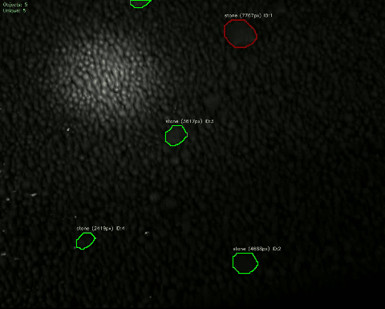

# 🎯 YOLOv8 Segmentation Pipeline

> Powerful CLI tool for training, evaluating, and running real-time demos with YOLOv8 instance segmentation and tracking.

---

## 🚀 Возможности

- 📦 Обучение модели сегментации на своем датасете
- 🧠 Использование YOLOv8 (Ultralytics) для сегментации и трекинга объектов
- 🎥 Поддержка изображений и видео
- 👁️ Реализация демо-режима в реальном времени
- 📊 Логгирование обучения и инференса

---

## 📚 Руководство пользователя

### 🔧 Установка

1. Установите зависимости:
pip install -r requirements.txt

🏋️ Обучение модели
python main.py train --data path/to/data.yaml --epochs 50 --batch 16
После обучения веса сохранятся в ./model/.

🔍 Оценка модели
python main.py evaluate --input path/to/image_or_video_or_folder --output ./results --weights ./model/weights/best.pt
Поддержка форматов: .jpg, .png, .bmp, .mp4, .avi, .mov, .mkv
Результаты сохраняются в ./results

👁️ Демо-режим
python main.py demo --input path/to/image_or_video --weights ./model/weights/best.pt
Нажмите Q в окне, чтобы выйти из режима просмотра.

📸 Пример работы
См. demo.gif выше для демонстрации сегментации и трекинга.

⚙️ Требования
Python 3.8+

OpenCV
Ultralytics YOLOv8
PyTorch
